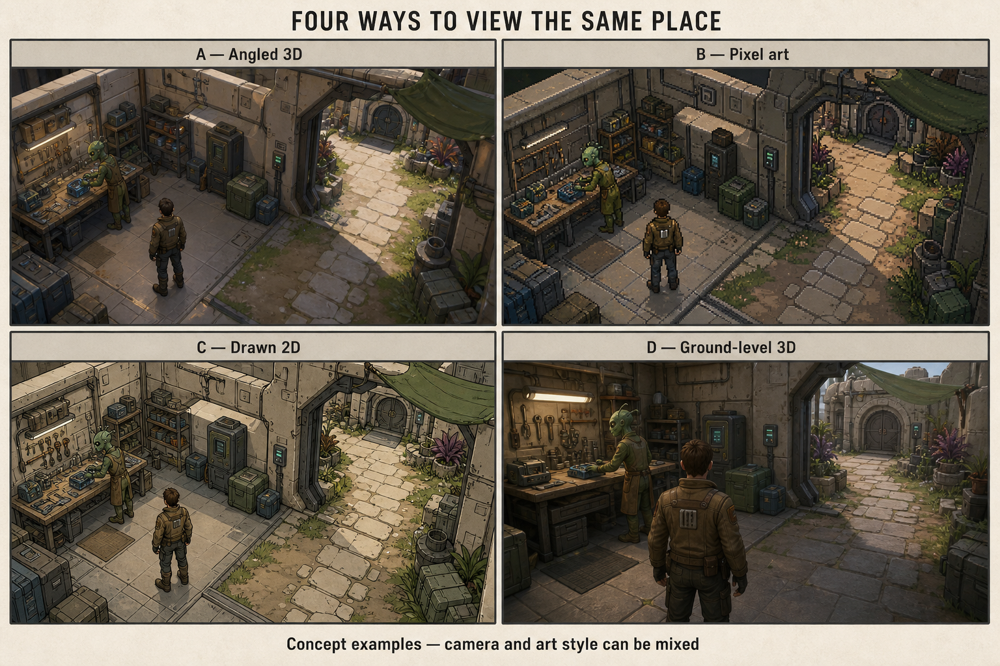

# Visual direction and production test

The owner selected **C — Drawn 2D**. The local [comparison image](reference/visual-comparison.png) is a taste reference, not a runtime screenshot or game-ready asset. Its setting, character, pet, and props are illustrative rather than approved canon.

Use illustrated environments and characters with readable outlines and an angled overhead viewpoint as the starting reference. Exact camera behavior, animation technique, scale, and implementation remain open. Smaller detailed locations linked by travel are provisionally acceptable. Other simplifications have not been accepted by implication.

## S01 decision criteria

Compare ways to create characters, direction changes, walk cycles, pet movement, creature cues, environment occlusion, and power effects consistently. Consider authored sprite/cutout approaches and suitable existing asset sources, but do not select merely from a single attractive still. Verify current tool capabilities and specific rights when choosing a source. Record creation plus cleanup/import effort, not generation time alone.

## S02 sample

One small walkable area; one moving human; following alien placeholder pet; one readable creature preparation/action cue; one representative power effect; doorway/occlusion; readable interaction cue. Create a second matching environment element from the same documented recipe and import it. Record actual Mac/display conditions and effort for both assets.

Owner aesthetic feedback, functional readability, and production repeatability receive separate verdicts. If the look cannot be sustained in motion, revise the workflow and show the result before expanding content. Do not replace this spatial direction with a text interface without an owner decision.

## S01 engineering decision

[Technical approach](technical-approach.md) selects illustrated masters, layered Krita cleanup and Godot cutout animation for the S02 test, with authored PNG frames as fallback. This resolves tooling direction only. The fixed camera and four displayed facing groups remain sample hypotheses; no moving aesthetic or production workflow has been accepted.
